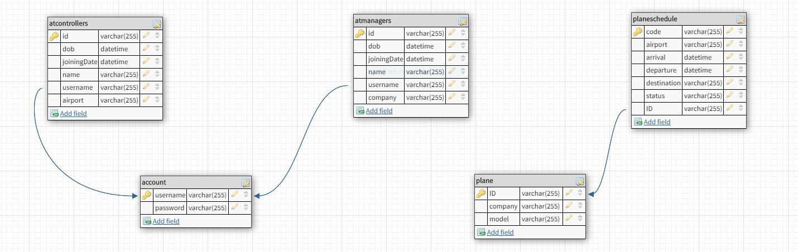
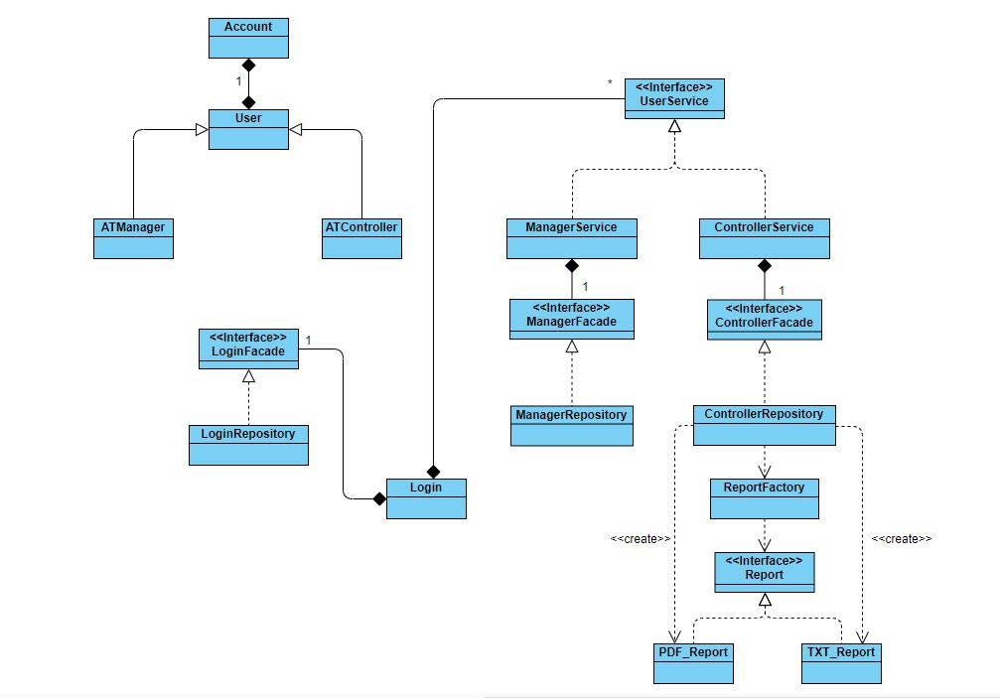

# Aplicatie mentru managementul traficului aerian

## Descrierea problemei

Am ales sa creez o aplicatie care sa ajute controlorii de trafic aerian sa managerieze cursele ce vin si pleaca de pe un aeroport. Totodata, aplicatia poate sa-i ajute pe managerii companiilor ce efectueaza curse sa si le planifice in functie de programul sosirilor si plecarilor de pe un aeroport pentru optimizarea si eficientizarea procesului.
Astfel, aplicatia poate rezolva probleme de o importanta ridicata intr-un mediu foarte riguros si de mare importanta.

## Solutia aleasa

Aplicatia incorporeaza o suita de moduri de moduri de lucru, separate in functie de tipul de user care o foloseste.
Userii pot fi:
* Controlori de trafic aerian ce au posibilitatea de a controla cursele ce vin si pleaca de pe un anumit aeroport, putand genera rapoarte si modifica la nevoie planuri de zbor prin operatiuni de tip CRUD pe bazele de date aferente.
* Manageri ai unei companii aeriene ce pot verifica planurile de zbor al unui aeroport pentru a creea curse aeriene. Ei pot modifica cursele sau chiar anula, tot prin intermediul operatiilor de tip CRUD asupra bazei de date.

Aplicatia incorporeaza un sistem de login ce ofera acces la un cont in baza de date aferent tipului de utilizator ce face log-inul.

## Implementare

Pentru implementarea solutiei, am ales sa folosesc Springboot impreuna cu Hibernate pentru accesul si manipularea bazei de date necesare, instantiata pe un server MySql.

Tabele sunt impartite in 2 categorii, cele aferente utilizatorilor, una pentru Controlori de trafic si alta pentru Manageri. Acestea sunt legate printr-o relatie de unu la unu prin campul username cu o tabela ale ce contine credentialele necesare logarii in sistem(username si parola).

Totodata am creat tabele aferente unei curse aeriene si unui avion. Tabela Plane contine datele ce descriun un avion, iar tabele PlaneSchedule contine cursele aeriene ce se realizeza. Acestea sunt legate prin intermediul campului ID din PlaneSchedule in relatie 1 la 1 cu acelasi camp din tabela Plane.

### Diagrama baza de date

### Diagrama de clase

## Testare

Testarea se realizeaza cu ajutorul JUnit. Pentru a usura generarea cazurilor de test se utilizeza pachetul Mockito. Pana acum am reusit sa testez capabilitatile de login al unui utilizator.
