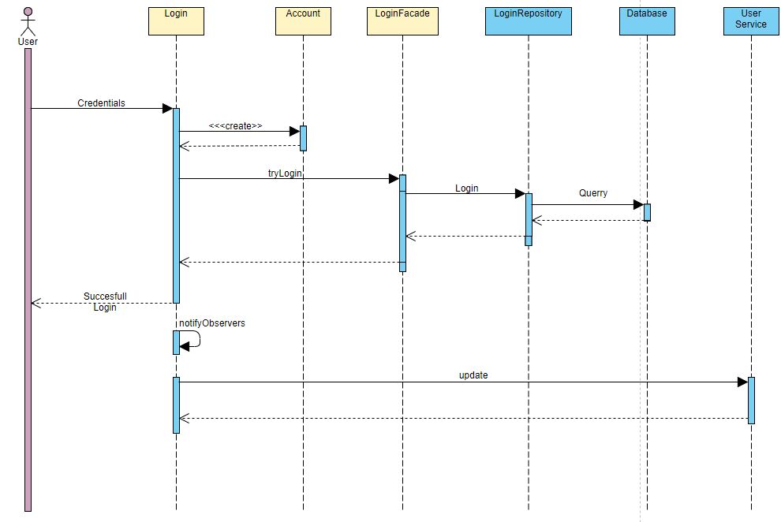

# Aplicatie mentru managementul traficului aerian

## Descrierea problemei

Am ales sa creez o aplicatie care sa ajute controlorii de trafic aerian sa managerieze cursele ce vin si pleaca de pe un aeroport. Totodata, aplicatia poate sa-i ajute pe managerii companiilor ce efectueaza curse sa si le planifice in functie de programul sosirilor si plecarilor de pe un aeroport pentru optimizarea si eficientizarea procesului.
Astfel, aplicatia poate rezolva probleme de o importanta ridicata intr-un mediu foarte riguros si de mare insemnatate.

## Solutia aleasa

Aplicatia incorporeaza o suita de moduri de moduri de lucru, separate in functie de tipul de user care o foloseste.
Userii pot fi:
* Controlori de trafic aerian ce au posibilitatea de a gestiona cursele ce vin si pleaca in spatiul aerian definit, putand genera rapoarte si modifica la nevoie planuri de zbor prin operatiuni de tip CRUD pe bazele de date aferente.
* Manageri ai unei companii aeriene ce pot modifica planurile de zbor al avioanelor din subordinea lor pentru a creea curse aeriene. Ei pot gestiona avioanele si zborurile companiei lor, tot prin intermediul operatiilor de tip CRUD asupra bazei de date.

Aplicatia incorporeaza un sistem de login ce ofera acces la un cont in baza de date aferent tipului de utilizator ce face logi-nul.

## Implementare

Pentru implementarea solutiei, am ales sa folosesc Springboot impreuna cu Hibernate pentru accesul si manipularea bazei de date necesare, instantiata pe un server MySql.

### Baza de date

Tabele sunt impartite in 2 categorii, cele aferente utilizatorilor, una pentru Controlori de trafic si alta pentru Manageri. Acestea sunt legate printr-o relatie de unu la unu prin campul username cu o tabela ale ce contine credentialele necesare logarii in sistem(username si parola).

Totodata am creat tabele aferente unei curse aeriene si unui avion. Tabela Plane contine datele ce descriun un avion, iar tabele PlaneSchedule contine cursele aeriene ce se realizeza. Acestea sunt legate prin intermediul campului ID din PlaneSchedule in relatie 1 la 1 cu acelasi camp din tabela Plane.

### Structura aplicatiei

Am structurat aplicatia pe baza arhitecturii pe 3 straturi BLL:
* Entity: in acest pachet se afla clasele de model ale bazei de date
* Repository: acest pachet contine clasele ce realizeaza operatiile CRUD asupra bazei de date.
* Business: contine clasele care se ocupa cu logica aplicatiei

#### Diagrama de clase

#### Design patterns

* Pentru a realiza o legatura cat mai facila intre layer-ele de repository si business am utilizat design patternul ***Facade*** care ofera posibilitatea de a utiliza functiile de acces la baza de date intr-o maniera mult mai simpla.

* In contextul in care aplicatia are mai multi utilizatori, am dori ca sa putem memora ce utilizator este logat in sistem la un moment dat. Prin intermediul design patter-ului ***Observer*** putem ca atunci cand un utilizator se logheaza cu succes in aplicatie sa ii memoram userul in clasa de service ce ii apartine, trimitand prin metoda notifyObservers() contul sau.

* Am imlementat factory design pattern pentru a realiza generarea de rapoarte a programului de zboruri in functie de tipul de fisier dorit(pdf sau txt). Controlorul de trafic poate genera acest raport primind extensia de fisier.

### Diagrama de secventa a login-ului

## Testare

Testarea se realizeaza cu ajutorul JUnit. Pentru a usura generarea cazurilor de test se utilizeza pachetul Mockito. Acestea vor putea atesta veridicitatea si corectitudinea solutiei alese si implementate.

## Manual de utilizare

1. Se lanseaza in executie aplicatia java de backend prin rularea metodei main din clasa DemoAplciation.

2. Se acceseaza pagina ***index.html*** din proiectul de UI.

3. Un utilizator are opriunea de a se loga in contul lui cu ajutorul usernameului si parolei aferente, fiind apoi redirectionat inspre pagina cu comenzile corespunzatoare tipului de cont. Totodata, un utilizator isi poate inregistra un nou cont, fie de manager, fie de controller.

	* Managerul poate adauga avioane si zboruri in sistem, poate vedea toate avioanele companiei sale sau poate sa stearga avioane si zboruri.

	* Controllerul poate genera un raport al zborurilor in doua formate: TXT sau PDF, fiserul regasindu-se in folderul sursa al aplicatiei. Totodata, acesta poate vedea toate zborurile la un moment dat si poate sa modifice statusul unui zbor.

4. La orice moment se poate reveni la pagina anterioara prin apasarea butonului de inapoi al browserului.

## Concluzii

Proiectul in starea actuala implementeaza operatiile de baza ce ar putea fi realizate in cadrul unui sistem de gestiune al traficului aerian. Datorita implementarii modulare si flexibile, acesta poate fi foarte usor moidficat si imbunatatit prin adaugarea de noi functionalitati si servicii. Bazele sistemului sunt solid implementate, astfel ca acesta va putea fi upgradat fluid si voluminos prin adaugarea de module ce ar putea:

* Adaugarea conceptului de pasager care se poate imbarca intr-un anumit zbor

* Modularizarea unei curse aeriene pentru a permite posibilitatea de cumparare de bilete

* Adaugarea de noi capabilitati controllerului de trafic aerian, cum ar fi radar meteo

* Extinderea sistemului de login

* Test 2

